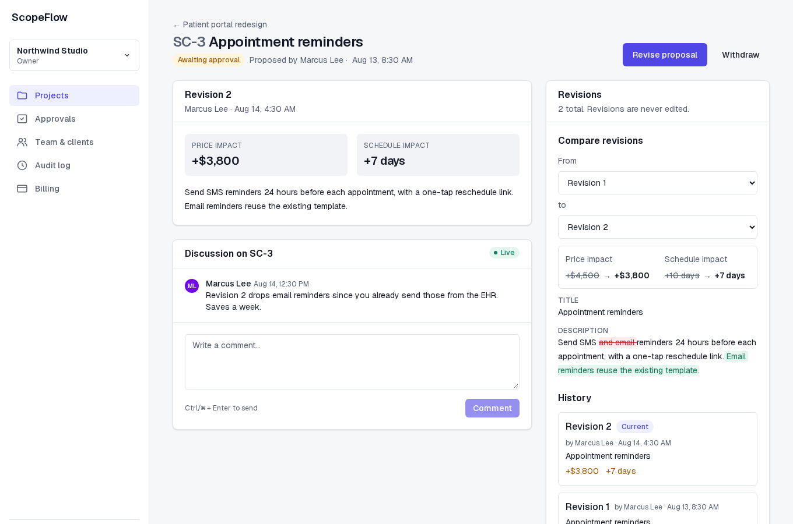
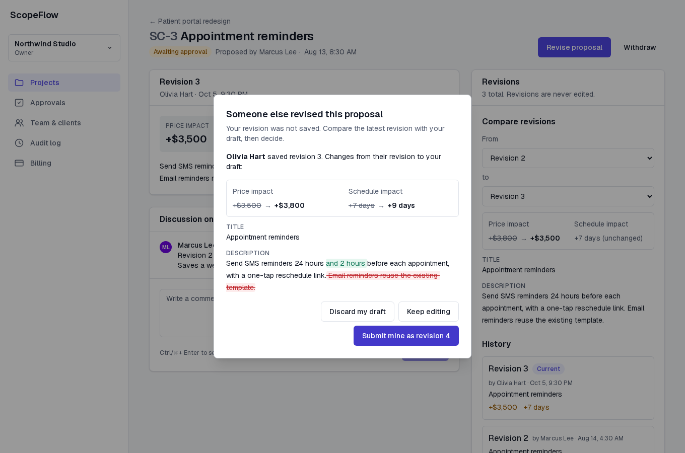
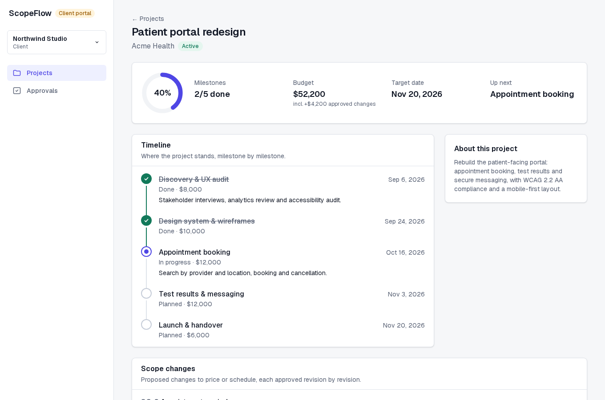
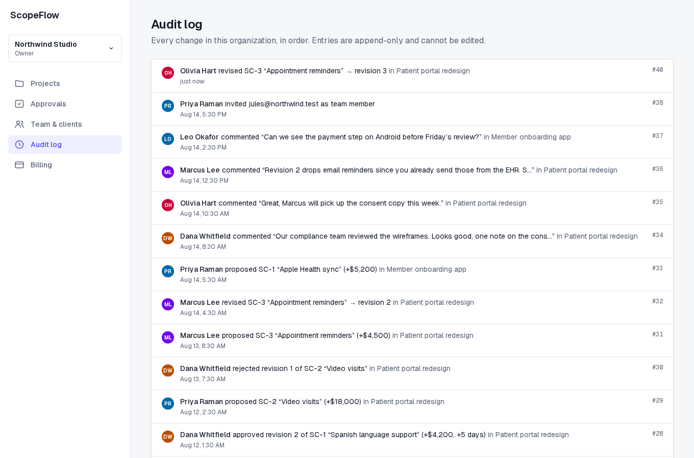
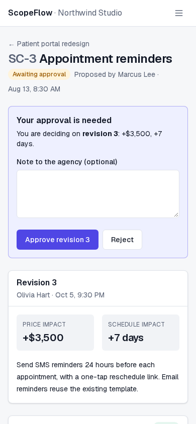
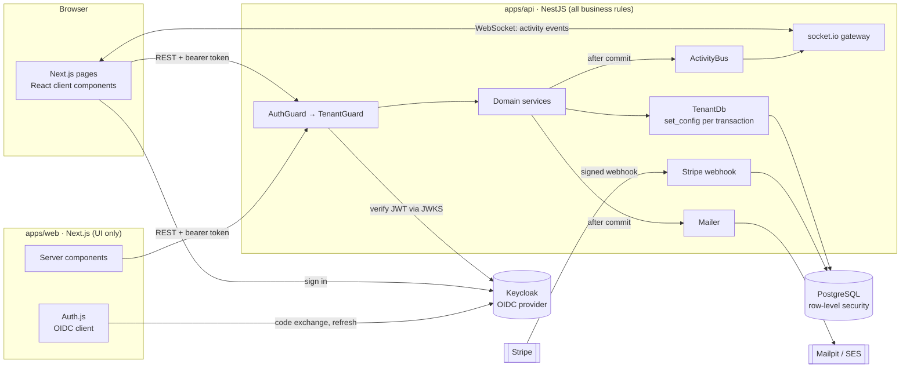
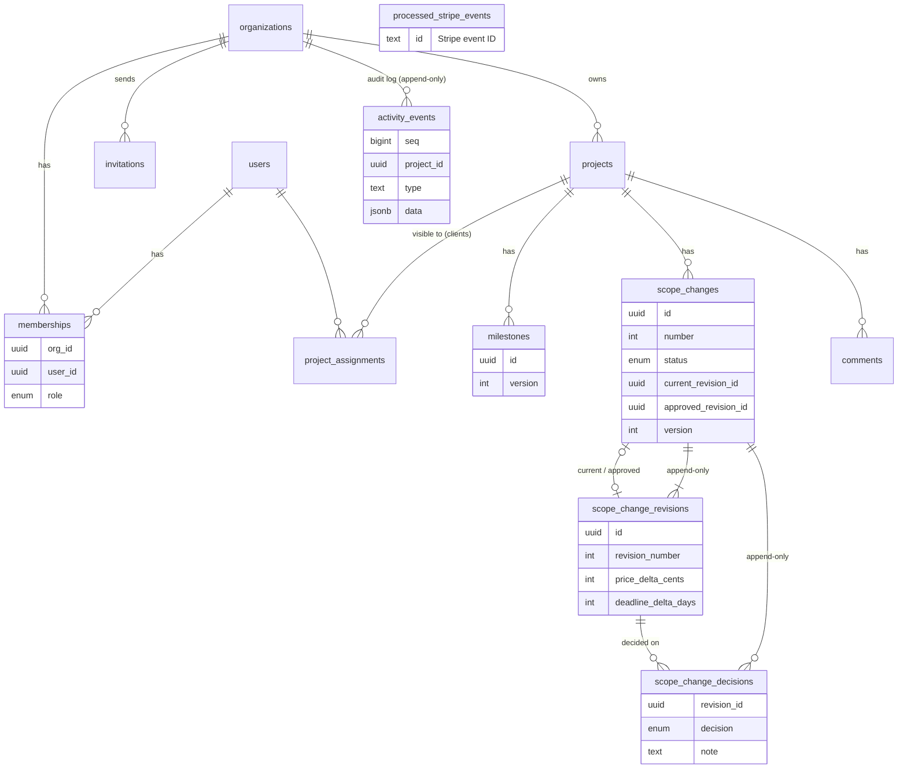

# ScopeFlow

Client projects, scope changes and approvals for agencies, built as a multi-tenant SaaS.

An agency runs its client projects in ScopeFlow. When a client asks for something new, the
agency proposes a scope change with its price and schedule impact. The client approves
a specific revision, and each change and decision is recorded in an append-only audit log.
Comments and activity stream live to everyone on the project.



<table>
  <tr>
    <td><br><sub>A stale edit returns a 409 with the saved revision for comparison.</sub></td>
    <td><br><sub>Client portal: only the projects the client is assigned to.</sub></td>
  </tr>
  <tr>
    <td><br><sub>Append-only audit log with every revision and decision.</sub></td>
    <td><br><sub>Approving a specific revision on a phone.</sub></td>
  </tr>
</table>

## The problem

Scope changes can lead to unpaid work and disputes over what a client approved.
ScopeFlow records the proposal revision behind each approval:

- A proposal's content lives in immutable revisions. Editing creates revision N+1; nothing
  overwrites what a client already saw.
- A client's approval stores the revision ID they were looking at. If the agency revised it
  in the meantime, the approval is refused and the client is shown what changed.
- Postgres prevents updates and deletes in the append-only audit log.

## Features

- Organizations with owner / admin / member / client roles, emailed invitation links,
  and an org switcher.
- Projects and milestones; clients see only the projects they are assigned to, in a
  dedicated client portal view.
- Scope-change proposals with revisions, a word-level revision diff, an approval inbox
  and decision notes.
- Optimistic locking on milestones and proposals: a stale edit gets a 409, and the UI shows
  a field-by-field conflict view instead of overwriting.
- Live comments and activity over WebSockets, with cursor-based resync after a
  reconnect.
- Stripe subscriptions (test mode) with a signature-verified, idempotent webhook.
- Email notifications through a mailer interface (Mailpit locally, SES in production).

## Architecture



Next.js renders the UI. Every read and write goes to the NestJS API with the user's
Keycloak access token. The API enforces authentication, tenancy, roles, versioning
and plan limits.

### Data model



Every tenant table carries `org_id`. Postgres triggers stop a row in one org from referencing a
project or proposal in another, and make revisions, decisions and audit events append-only.

## Design decisions

### Authentication

Keycloak issues signed access tokens and handles login, registration and password reset.
The API checks their signature, issuer, audience and expiry against Keycloak's JWKS.
Auth.js handles the OIDC code exchange and token refresh inside Next.js.
Organization roles live in ScopeFlow's `memberships` table, since a user can have different
roles in different organizations. Keycloak adds a service to the local stack and takes
about 20 seconds to start.

### Tenant isolation

Tenant requests run inside `TenantDb.run()`, which opens a transaction and sets
`app.org_id`, `app.user_id` and `app.role`
with `set_config(..., true)`. RLS policies compare rows against those settings, and the API
connects as a role that cannot bypass them. A guard can check that you belong to org A, but
it cannot stop a service from loading a row of org B by primary key; a Prisma
`where: { orgId }` extension misses raw queries and nested relations. With RLS the database
filters rows regardless of which code path built the query. Client visibility (assigned projects only)
lives in the same policies. This requires a transaction for each tenant operation and
SQL policies that need separate review. System paths that bypass RLS (sign-in, webhook lookup,
invitation acceptance, notification recipients) use a separate client and are listed in
[`apps/api/src/db/README.md`](apps/api/src/db/README.md).

### Revisions and approvals

A proposal row holds status, version and pointers to its current and approved revision.
Content is in `scope_change_revisions`, which
the app role cannot update or delete and a trigger guards for everyone else. Approval is a
conditional update (`WHERE current_revision_id = :approved AND status = 'PENDING'`), so
"approve revision 2" and "publish revision 3" can race safely.

### Concurrent edits

Writes carry the version they were based on and update `WHERE version = :v`.
If no rows match, the API returns 409 with the current state. The UI shows the
saved values alongside the attempted edit. No locks are held while a form is open.

### Live updates

Writes go through REST. The gateway pushes committed activity events into per-project rooms.
Each event has a global, increasing `seq`; clients
remember the last one and, on every (re)connect, fetch `activity?after=<seq>` and apply events
deduplicated by `seq`. This recovers events missed during a dropped connection. The in-process
event bus means one API instance; scaling out needs the socket.io Redis adapter.

### Broadcasts and email

Broadcasts and emails are registered with `TenantDb.afterCommit()` so they never describe
a transaction that rolled back. Email is sent
inline after commit rather than through an outbox; a crash in that window loses one
notification. An outbox would allow the application to retry those deliveries.

### Stripe webhooks

The event ID is inserted into `processed_stripe_events` in the same transaction as
the side effects (see the failure
scenario below). Out-of-order subscription events are dropped using the event's creation time.

## Running it locally

Requirements: Docker, Node 24 and pnpm 11. The ports used are 3100 (web), 4100 (api),
5544 (Postgres), 8180 (Keycloak) and 8125 (Mailpit UI).

```bash
cp .env.example .env
pnpm install
docker compose --profile app up -d --build --wait
pnpm db:seed
```

Open http://localhost:3100. Mailpit (all outgoing email) is at http://localhost:8125.

For development with hot reload, run only the infrastructure in Docker:

```bash
docker compose up -d --wait          # postgres, keycloak, mailpit
pnpm --filter @scopeflow/shared build
pnpm db:migrate && pnpm db:seed
pnpm dev                             # api on :4100, web on :3100
```

Stripe is optional. Without `STRIPE_SECRET_KEY` the billing page explains that checkout is not
configured. To try test mode, add your test keys and two price IDs to `.env`, then forward
webhooks with `stripe listen --forward-to localhost:4100/billing/webhook` and put the printed
signing secret in `STRIPE_WEBHOOK_SECRET`.

### Demo accounts

All passwords are `scopeflow-demo`.

| Account | Role | What to look at |
|---|---|---|
| olivia@northwind.test | Owner, Northwind Studio | Everything, including billing and the audit log |
| priya@northwind.test | Admin, Northwind Studio | Team management, invitations |
| marcus@northwind.test | Team member, Northwind Studio | Projects, milestones, proposals |
| dana@acmehealth.test | Client (Acme Health) | Client portal: sees 2 of Northwind's 4 projects; SC-3 awaits her approval |
| leo@brightpath.test | Client (BrightPath Fitness) | Sees only the onboarding app project |
| sam@harborpine.test | Owner, Harbor & Pine | A second agency; sees none of Northwind's data |

To try the approval flow, sign in as Olivia in one browser and Dana in a private window. Open
*Patient portal redesign → SC-3*, comment from both sides, revise as Olivia while Dana is
looking, then approve as Dana.

## Tests

| Layer | Tool | Notable coverage |
|---|---|---|
| API integration | Vitest + Supertest, real Postgres | Tenant-isolation tests enumerate registered routes and send another organization's IDs, then check status codes, response bodies and hashes of that organization's rows. Disabling the membership check or bypassing RLS makes the test fail. The suite also covers client visibility, revision immutability, approval/revision races, optimistic locking, Stripe replay and concurrency, socket.io scoping, revocation and resync. |
| Database | Vitest | RLS policies and triggers tested directly as the app role. |
| Web | Vitest + React Testing Library | Conflict-merge dialog, revise conflict flow, real-time provider resync and dedupe, formatting. |
| End to end | Playwright | Two browser contexts: propose → live comments → two-tab edit conflict → approve the final revision → audit trail. Also the WebSocket-drop scenario and federated sign-out. |
| Accessibility | axe-core | WCAG 2.2 AA on the main pages, light and dark, desktop and mobile (run during development). |

```bash
pnpm test        # unit + integration (needs `docker compose up -d postgres`)
pnpm e2e         # needs the full stack running; reseeds the database first
```

CI runs lint, typecheck, format check, all tests, a fresh migrate + seed, `cdk synth`, and the
Playwright suite against the production Docker images.

## Failure scenarios

### A client's WebSocket drops while the agency keeps working

1. Dana's laptop loses its connection. socket.io notices and the page shows *Reconnecting…*.
2. Olivia posts two comments and moves a milestone. The API commits them and broadcasts the
   events to the project room, which no longer includes Dana's socket.
3. Dana's connection returns. The socket's `auth` callback fetches a fresh access token (it may
   have expired meanwhile), the server re-checks that she can still see the project, and she
   rejoins the room.
4. The client calls `GET /orgs/:org/projects/:project/activity?after=<last seq it saw>` and
   applies the missed events in order. Events are keyed by `seq`, so anything that also
   arrives live is ignored the second time. Milestone and proposal events trigger a refetch of
   the server-rendered data.

Dana ends up with both comments exactly once and the current milestone status, without
reloading. If her access had been revoked while she was offline, the rejoin would be refused.
This is the `reconnect.spec.ts` Playwright test, which cuts the socket with
`page.routeWebSocket`, and `realtime.e2e-spec.ts` on the API side.

### Stripe delivers the same webhook twice

Stripe retries deliveries it didn't see acknowledged, and can send two copies at nearly the
same time. The handler:

1. Verifies the signature against the raw request body (`400` otherwise).
2. Opens a transaction and inserts the event ID into `processed_stripe_events` (primary key).
3. Applies the change (plan, status, period end) and writes a `billing.plan_changed` audit event
   in the same transaction.

A second delivery fails the primary key insert and is acknowledged with
`{ "status": "duplicate" }` and no side effects. If two copies arrive concurrently, the
second insert waits on the first transaction's row lock and then sees the duplicate. If
processing fails halfway, the whole transaction, ledger row included, rolls back and Stripe's
retry processes it cleanly. `billing.e2e-spec.ts` covers replay, five concurrent copies,
out-of-order events and the failure-then-retry case.

## Deployment

The AWS deployment (ECS Fargate, ALB, RDS PostgreSQL, Secrets Manager, SES, CloudWatch) is an
AWS CDK app in [`infra/aws`](infra/aws/README.md), with a step-by-step runbook. Both apps ship
as multi-stage Docker images that run as a non-root user.

## Project layout

```
apps/api           NestJS API: auth, tenancy, domain modules, realtime gateway, billing, email
  prisma/          schema, migrations (including RLS policies and triggers), seed
  test/            integration tests against real Postgres
apps/web           Next.js App Router UI
packages/shared    zod schemas, roles, plans, event types, diff and money helpers
e2e/               Playwright suite
infra/             Postgres init SQL, Keycloak realm, AWS CDK app
docs/development.md local setup, implementation notes and test guidance
```
